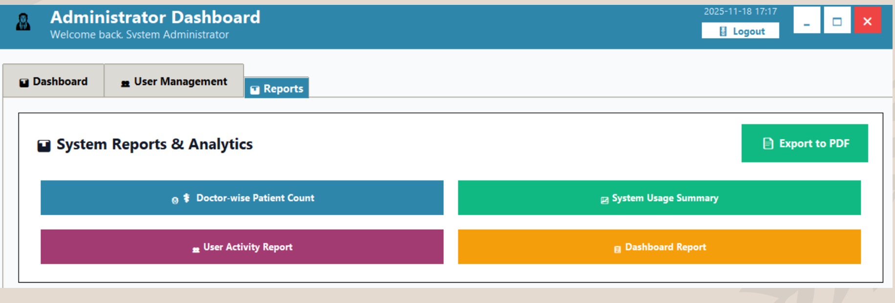
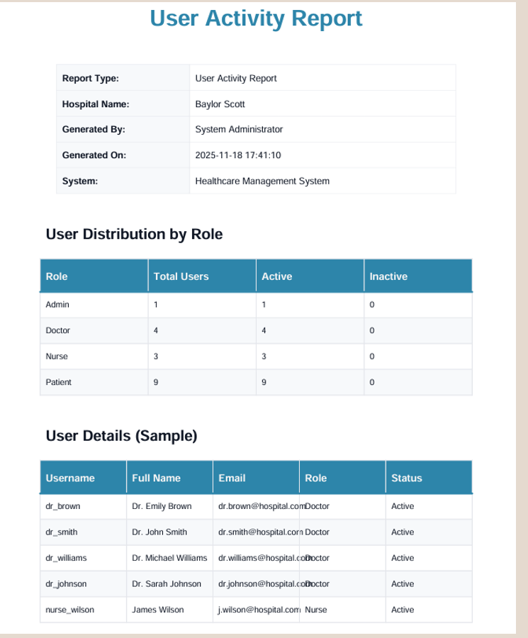

# Healthcare Patient Information Management System (HPMS)

A comprehensive healthcare management system with role-based access control for Patients, Doctors, Nurses, and Administrators Built using Python, MySQL, Tkinter, and ReportLab

## 📋 Table of Contents
- [Project Overview](#-project-overview)
- [Features](#-features)
- [Technology Stack](#-technology-stack)
- [System Architecture](#-system-architecture)
- [Database Schema](#-database-schema)
- [Installation Guide](#-installation-guide)
- [Project Structure](#-project-structure)
- [Screenshots](#-screenshots)
- [Team Members](#-team-members)
- [License](#-license)

---

## 🔍 Project Overview
The **Healthcare Patient Information Management System (HPMS)** is a desktop-based healthcare solution developed using Python, Tkinter, and MySQL.The system allows healthcare organizations to efficiently manage patient records, appointments, prescriptions, vital signs, and user accounts through a secure role-based access control system. 

The application supports four major user roles:
* **Patient** 
* **Doctor** 
* **Nurse** 
* **Administrator** 

---

## ✨ Features

### 👤 Patient Features
| Feature | Description |
| :--- | :--- |
| **Registration** | Create and manage patient accounts |
| **Appointment Booking** | Schedule appointments with doctors |
| **Medical Records** | View prescriptions and medical history  |
| **Profile Management** | Update personal information  |
| **Appointment Tracking** | View upcoming and previous appointments  |

### 🩺 Doctor Features
| Feature | Description |
| :--- | :--- |
| **Patient Records** | View complete patient information  |
| **Prescriptions** | Create and manage prescriptions  |
| **Appointment Management** | Review patient appointments |
| **Clinical Notes** | Add treatment notes  |
| **Patient Monitoring** | Review vital signs and history  |

### 👩‍⚕️ Nurse Features
| Feature | Description |
| :--- | :--- |
| **Vital Recording** | Record temperature, heart rate, blood pressure  |
| **Patient Support** | Access patient information  |
| **Appointment Review** | View scheduled appointments  |

### 👑 Administrator Features
| Feature | Description |
| :--- | :--- |
| **User Management** | Create and manage user accounts  |
| **Report Generation** | Generate PDF reports  |
| **System Monitoring** | View healthcare statistics  |
| **Access Control** |Manage user permissions  |

---

## 🛠️ Technology Stack

| Component | Technology |
| :--- | :--- |
| **Frontend** | Python Tkinter  |
| **Backend** | Python 3.x  |
| **Database** | MySQL  |
| **Database Connector** | `mysql-connector-python`  |
| **Reporting** | ReportLab  |
| **Version Control** | Git & GitHub  |

---

## 🏗️ System Architecture

Data maps and moves fluidly from user interactions down through local rendering processes and database entities:

```text
Patient / Doctor / Nurse / Admin                │
               ▼
          Tkinter GUI 
               │
               ▼
     Python Business Logic 
               │
               ▼
         MySQL Database  ◄──►  PDF Report Generation 

🗄️ Database Schema
The healthcare structure manages system entries through the following core operational records: 
Table	Purpose
users	Stores login and role information 
patients	Patient personal and medical details 
doctors	Doctor information and specialization 
nurses	Nurse information 
appointments	Appointment scheduling 
prescriptions	Medication records 
vitals	Patient vital signs history 


Installation Guide

1. Clone Repository
git clone <repository-url> cd healthcare-system 

2. Install Dependencies
pip install mysql-connector-python pip install reportlab 
3. Configure Database
1.	Create a MySQL database. 
2.	Import healthcare SQL database.sql into your workspace. 
3.	Update database credentials in db_config.py. 

4. Run Application
python main.py 
📂 Project Structure
Healthcare-System/ 
├── main.py                         # Main entry application file 
├── healthcare SQL database.sql     # Database setup queries and schema 
├── create_dummy_data.py            # Script to generate sample database logs 
├── reports/                        # Report generation modules (ReportLab) 
├── database/                       # Connection setup scripts 
├── modules/                        # Separate application role dashboards 
├── tests/                          # Automated testing sequences 
├── screenshots/                    # Stored application interface assets 
└── README.md                       # Markdown project documentation 

📸 Screenshots
The following system interfaces document the layout and workflow of the environment:
Login Screen


 
Registration Screen


 
Patient Dashboard


 


Doctor Dashboard


 
Nurse Dashboard

 


Admin Dashboard


 
System administration portal displaying real-time hospital statistics including totals across all user groupings. 
Reports Screen



 
 

 


👥 Team Members
•	Pragya Chand 
•	Akarsha Bohath 
📄 License
This project was developed exclusively for academic and educational purposes. All testing, evaluation charts, and structures belong to their respective university coursework timelines.


